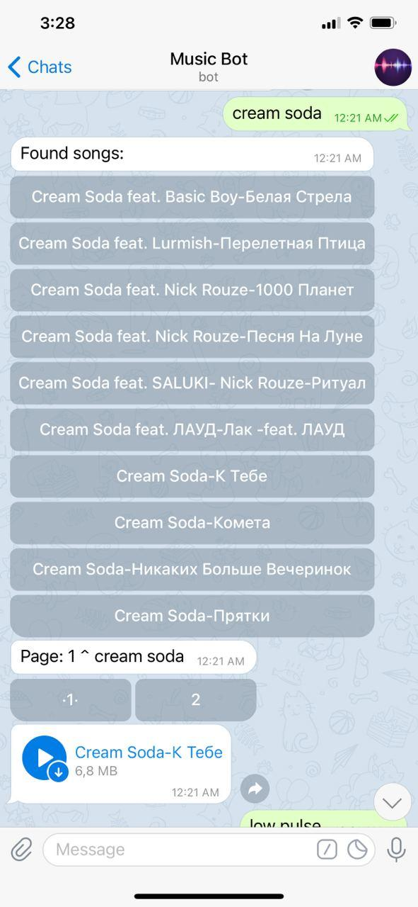
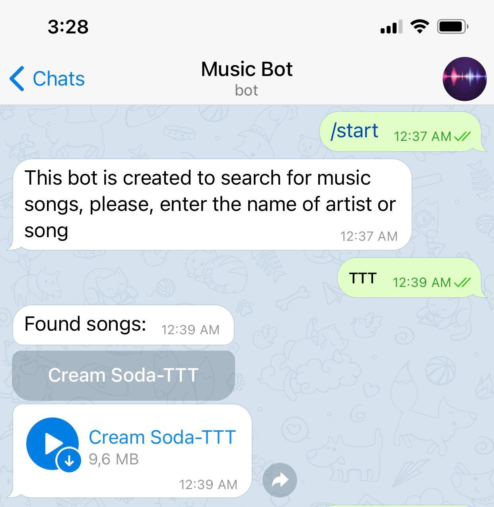

# Music bot :musical_note:
## @melody_tg_bot https://t.me/melody_tg_bot 

In this project you can find and download tracks that are not available in Apple Music or Spotify. 
This is mainly for underground music. The bot uses dropbox API to download & upload files. It is hosted on PaaS Heroku.

## Commands
 * `/start`
 * `/help`
 * `/screen` (to upload media with password)
 * `/shot` (to get media with same password)
 * `/delete` (to delete all media with current password)
 
 ## Requirements
  * `pip install dropbox`
  * `pip install PyTelegramBotApi`
  * get API keys from dropbox and telegram bot father, replace them accordingly
  * create *Procfile* and put a line with the following format with a name of your main python file
  * create *requirements.txt* list
  * create an account in heroku and deploy github repository (Procfile and requirements.txt are necessary for deployment)

 ## Work flow
  In order to find the song or artist, just enter name to bot and it will search songs in the dropbox cloud
    
    